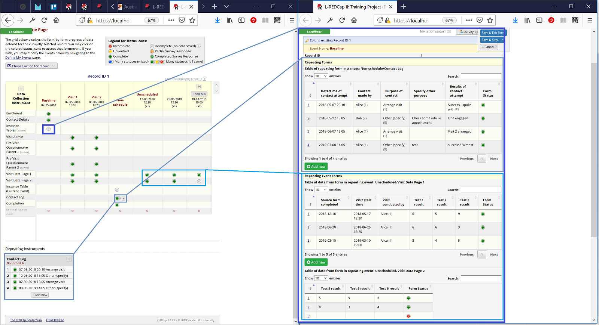

# REDCap External Module: MCRI Instance Table (Stanford fork)

Stanford fork of https://github.com/lsgs/redcap-instance-table

Use the action tag @INSTANCETABLE=form_name in a descriptive text field to include a table showing data from repeat instances of that form.

If project is longitudinal, use @INSTANCETABLE=event_name:form_name to specify the event and form (can be a repeating form or a form in a repeating event). Event defaults to current event if not specified.

* Add or Edit instances in popup window (View only if user has read-only permission for the repeating form).
* Option to hide fields from table using @INSTANCETABLE_HIDE tag on the repeating field.
* Option to specify column headings using @INSTANCETABLE_LABEL='label' tag (default is field label).
* Default behaviour is for a wide table to cause its container to grow. Use @INSTANCETABLE_SCROLLX to get a horizontal scroll-bar instead.
* Uses DataTables to facilitate sorting, search and paging within the table of instance data.
* Does not show table for users with no read permission to the repeating form.
* Displays in both regular data entry and survey forms.
* Survey view is read only with no links to the form instances.
* Adds an entry for @INSTANCE table into the Action Tags dialog on Project Setup and Online Designer pages.

## Example 
This example shows (on the right-hand side) a form containing three descriptive text fields utilising the @INSTANCETABLE action tag. 
* The first is tagged @INSTANCETABLE=nonschedule_arm_1:contact_log and hennce displays a table of data from the "Contact Log" form in the "Nonschedule" event".
* The second is tagged @INSTANCETABLE=unscheduled_arm_1:visit_data_page_1 and hence displays a table of data from the "Visit Data Page 1" form from the repeating "Unscheduled event.
* The third is tagged @INSTANCETABLE=unscheduled_arm_1:visit_data_page_2 and hence displays a table of data from the "Visit Data Page 1" form from the repeating "Unscheduled event.

##Stanford Enhancements
1. Added a filter to ensure that when you use this EM in a repeating form to embed a secondary
repeating form, only the associated records appear. Variants exists for use 
with LSGS/InstanceSelect and native association without an additional EM
1. Added a "Save and New" button to the popup displayed when clicking on the "New" button
1. Modified the existing "Save and Stay" to read "Save and Quit" to better reflect the actual functionality
1. Added a feature to specify the default value for the join key in the associated
repeating form when creating a new record

### Stanford Enhancement: Visualizing Hierarchical Data
 
When repeating forms are used to capture data with multiple one-to-many
relationships, you can use two additional action tags to perform data-driven
filtering.  For example, a patient can have many visits, and on each visit 
they can be taking multiple medications. Assuming medications are 
 represented in their own repeating form with the date of clinic visit
is denormalized into the medication data (e.g. using a SQL lookup field)
, you can use the date of visit
as a filter for the medication instance table.

#### Variant 1: for use in conjunction with InstanceSelect
If you have enabled and configured MCRI's InstanceSelect 
to establish the relationships between your repeating forms,
use
@INSTANCETABLE_REF=field on the field referred to by the linked instrument field with the @FORMINSTANCE annotation

For example, if visits have multiple medications, you could set up a form called visit with a descriptive field medication_list
that refers to the form called medications with an action tag on visit.medication_list, @INSTANCETABLE=medications.
The medications form has a field called med_visit_instance tagged with Field Annotation: @FORMINSTANCE=visit.
In this case, in addition to tagging visit.medication_list with
@INSTANCETABLE=medications, you would also add
 @INSTANCETABLE_REF=med_visit_instance. Now you have pointers in both directions, one from medications to visit
 with the @FORMINSTANCE=visit tag on medications.med_visit_instance, and a counterpart from visit to medications
 with the @INSTANCETABLE_REF=med_visit_instance tag on visit.medication_list.  This pair of bi-directional pointers
 enables the InstanceTable EM features supporting embedded repeating forms.

#### Variant 2: without InstanceSelect

@INSTANCETABLE_SRC=field on current instrument with the value for the filter

@INSTANCETABLE_DST=corresponding field on the @INSTANCETABLE instrument 

For example
Parent form 'visit' with date field 'visit_date' and the instance table
Child form 'meds' with date field 'med_visit_date'
The action tags will be

@INSTANCETABLE=meds

@INSTANCETABLE_SRC=visit_date

@INSTANCETABLE_DST=med_visit_date
